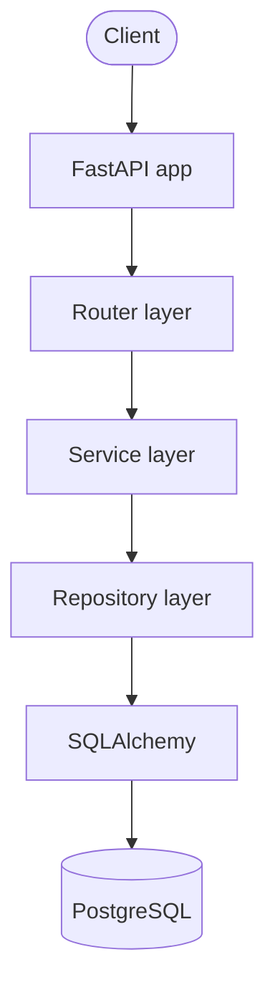
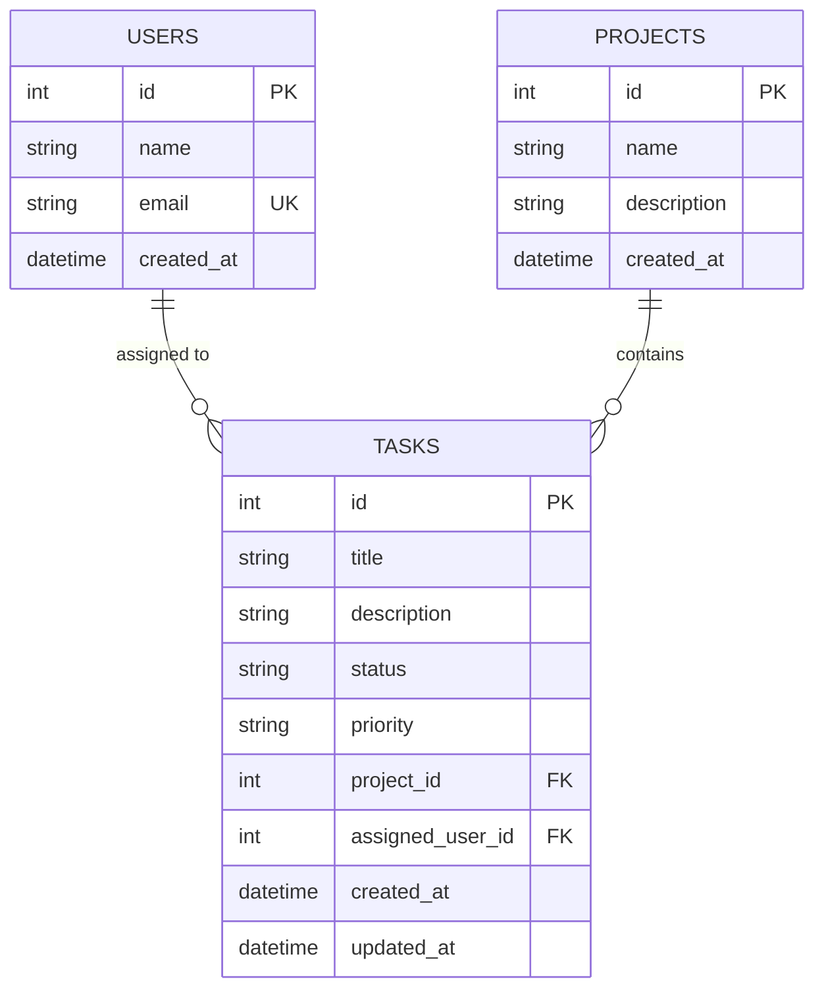

# TaskFlow API

A small, professionally structured REST backend for managing users, projects, and tasks — built to demonstrate practical new-grad backend engineering: a layered architecture, PostgreSQL + SQLAlchemy, automated testing, Docker, and basic observability.

## 1. Project Overview

TaskFlow lets a client create users, organize work into projects, and manage tasks within those projects — assigning tasks to users, tracking status and priority, and pulling basic per-project statistics. It is deliberately scoped as a single, well-understood backend service rather than a full project-management product.

## 2. Problem / Purpose

Most portfolio projects either stay too shallow (a CRUD toy with no real architecture) or balloon into unmaintainable scope. TaskFlow is sized to let one engineer demonstrate, and defend in an interview, every layer of a production-style backend: validation, layered architecture, relational data modeling, transactional business logic, meaningful tests, containerization, and observability — without unnecessary technology or product surface area.

## 3. Features

- Create and retrieve users
- Create and retrieve projects
- Create, retrieve, update (partial), and delete tasks
- Assign tasks to users; associate tasks with projects
- Task status (`todo` / `in_progress` / `done`) and priority (`low` / `medium` / `high`)
- Filtering, sorting, and pagination on task listings
- Per-project task statistics (counts by status/priority, unassigned count)
- Consistent JSON error responses with correct HTTP status codes
- Structured application logging
- A lightweight `/metrics` endpoint (request counts, error counts, latency, tasks created)
- Interactive OpenAPI/Swagger documentation

## 4. Technology Stack

| Concern | Choice |
|---|---|
| Language | Python 3.12+ |
| Web framework | FastAPI |
| Validation / schemas | Pydantic v2 |
| Database | PostgreSQL |
| ORM | SQLAlchemy 2.x (modern `Mapped[...]` style) |
| Migrations | Alembic |
| Testing | pytest, pytest-cov, httpx (via FastAPI's `TestClient`) |
| Containerization | Docker, Docker Compose |
| App server | Uvicorn |

## 5. Architecture

TaskFlow uses a layered architecture so that HTTP concerns, business rules, and data access don't get tangled together:



- **Router layer** (`app/routers/`) — parses/validates HTTP input via Pydantic schemas, calls a service, and maps the result to an HTTP response. No business logic and no direct database access here.
- **Service layer** (`app/services/`) — owns business rules: does the referenced project exist, is this email already taken, what counts as "the task list for a project." Talks to repositories, never to SQLAlchemy directly, and owns the transaction boundary (`commit()`).
- **Repository layer** (`app/repositories/`) — the only layer that writes SQLAlchemy queries. No business rules here, just data access.
- **Models** (`app/models/`) — SQLAlchemy ORM models plus enums for status/priority.
- **Schemas** (`app/schemas/`) — Pydantic request/response models, kept separate from ORM models so the API contract can evolve independently of the database shape.

This gives each layer one job, so a change to a validation rule, a query, or an HTTP status code touches exactly one file.

## 6. Project Structure

```text
Project1/
├── app/
│   ├── main.py                 FastAPI app, middleware, exception handlers, /health, /metrics
│   ├── config.py                Settings (env vars) via pydantic-settings
│   ├── database.py              Engine, session factory, declarative Base, get_db dependency
│   ├── logging_config.py        Logging setup
│   ├── metrics.py                In-process metrics collector
│   ├── models/                  SQLAlchemy ORM models (User, Project, Task)
│   ├── schemas/                  Pydantic request/response schemas
│   ├── repositories/            Data-access classes (one per aggregate)
│   ├── services/                 Business logic (one per aggregate)
│   ├── routers/                  FastAPI routers (one per resource)
│   └── utils/
│       └── exceptions.py         Domain exceptions (NotFoundError, DuplicateError)
├── tests/
│   ├── conftest.py                Shared fixtures (real Postgres test DB, transactional isolation)
│   ├── unit/                      Service-layer tests with mocked repositories
│   └── integration/               Full HTTP → DB tests via FastAPI TestClient
├── alembic/                      Migration environment + versions
├── Dockerfile
├── docker-compose.yml
├── requirements.txt
└── .env.example
```

## 7. Database Schema



**Constraints & indexes:**
- `users.email` — unique, indexed (duplicate signups rejected with `409`)
- `tasks.project_id` — `NOT NULL`, foreign key to `projects.id`, `ON DELETE CASCADE` (deleting a project deletes its tasks), indexed for filtering
- `tasks.assigned_user_id` — nullable (a task can be unassigned), foreign key to `users.id`, `ON DELETE SET NULL` (deleting a user un-assigns their tasks rather than deleting them), indexed for filtering
- `tasks.status`, `tasks.priority` — indexed, since both are common filter/sort targets

**Design decision — status/priority as `String` + Python `Enum`, not a native Postgres `ENUM` type:** SQLAlchemy's `Enum(..., native_enum=False)` stores these as `VARCHAR` with application-level validation via Python enums, rather than a native Postgres `ENUM` type. This trades a small amount of DB-level type safety for migrations that don't require `ALTER TYPE ... ADD VALUE` ceremony when a new status/priority is added — a reasonable tradeoff at this project's scale.

## 8. API Endpoints

| Method | Path | Description |
|---|---|---|
| POST | `/users` | Create a user (`409` on duplicate email) |
| GET | `/users` | List users (paginated) |
| GET | `/users/{id}` | Get a user (`404` if missing) |
| POST | `/projects` | Create a project |
| GET | `/projects` | List projects (paginated) |
| GET | `/projects/{id}` | Get a project (`404` if missing) |
| GET | `/projects/{id}/statistics` | Task counts by status/priority + unassigned count |
| POST | `/tasks` | Create a task (validates `project_id`/`assigned_user_id` exist) |
| GET | `/tasks` | List tasks — filter, sort, paginate |
| GET | `/tasks/{id}` | Get a task (`404` if missing) |
| PATCH | `/tasks/{id}` | Partially update a task |
| DELETE | `/tasks/{id}` | Delete a task (`204` on success) |
| GET | `/health` | Liveness check |
| GET | `/metrics` | Basic request/error/latency/task-creation metrics |

**`GET /tasks` query parameters:**
- `status`, `priority`, `project_id`, `assigned_user_id` — filters
- `sort_by` — one of `created_at`, `updated_at`, `priority`, `status`, `title` (default `created_at`)
- `order` — `asc` or `desc` (default `desc`)
- `limit` (1–200, default 50), `offset` (default 0) — pagination

Full request/response schemas are in the interactive docs (see §15).

## 9. Local Setup

**Prerequisites:** Python 3.12+, PostgreSQL running locally (or use Docker — see §11).

```bash
python3 -m venv .venv
source .venv/bin/activate
pip install -r requirements.txt
cp .env.example .env
```

> **Note on Python version:** this project was verified locally with Python 3.13. On a brand-new Python release (e.g. 3.14, at the time of writing), `pydantic-core`'s pinned version may not yet ship a prebuilt wheel, which forces a Rust source build that can fail if the toolchain isn't set up. If `pip install` fails while compiling `pydantic-core`, use Python 3.12 or 3.13 for local development (`python3.13 -m venv .venv`). The Docker image pins `python:3.12-slim` and is unaffected.

Edit `.env` to point `DATABASE_URL` at your local PostgreSQL instance.

## 10. PostgreSQL Setup

Create a database for the app to use, then run migrations:

```bash
createdb taskflow
alembic upgrade head
```

`DATABASE_URL` in `.env` must match whatever user/password/database you created, e.g.:

```text
DATABASE_URL=postgresql+psycopg2://<user>@localhost:5432/taskflow
```

## 11. Docker Setup

```bash
cp .env.example .env
docker compose up --build
```

This starts PostgreSQL (with a named volume for persistence and a healthcheck) and the API, which waits for the database to be healthy, runs `alembic upgrade head`, then starts Uvicorn on port 8000.

> **Note:** Docker was not available in the development sandbox this project was built in, so the `Dockerfile`/`docker-compose.yml` could not be executed there. The application itself was fully verified running natively against PostgreSQL (see §12–14). Verify `docker compose up --build` on a machine with Docker installed before relying on it.

## 12. Running the Application

```bash
source .venv/bin/activate
uvicorn app.main:app --reload
```

The API is then available at `http://localhost:8000`.

## 13. Running Tests

Tests run against a **real PostgreSQL database** (not SQLite), matching production behavior.

```bash
createdb taskflow_test
export TEST_DATABASE_URL=postgresql+psycopg2://<user>@localhost:5432/taskflow_test
pytest
```

Each test runs inside a transaction that's rolled back afterward (via a SAVEPOINT-based fixture), so tests never leave data behind or interfere with each other, even though the application code under test calls `commit()` normally.

## 14. Test Coverage

```bash
pytest --cov=app --cov-report=term-missing
```

As of the last verified run: **51 tests passing, 99% statement coverage** (unit tests for service-layer business logic with mocked repositories; integration tests for every endpoint, including validation failures, 404s, 409s, filtering, sorting, pagination, and project statistics). Coverage reports are also written to `htmlcov/` (open `htmlcov/index.html`).

## 15. API Documentation

Interactive documentation is auto-generated by FastAPI:

- Swagger UI: `http://localhost:8000/docs`
- ReDoc: `http://localhost:8000/redoc`
- Raw OpenAPI schema: `http://localhost:8000/openapi.json`

## 16. Logging / Observability

- **Logging:** structured, timestamped logs to stdout (startup/shutdown, user/project/task creation and updates, deletions, unhandled exceptions). Configured in `app/logging_config.py`. No secrets or credentials are ever logged.
- **Metrics:** `GET /metrics` returns a JSON snapshot — total request count, total error count, tasks created, and per-endpoint count/error-count/average-latency. This is an in-process counter (not Prometheus), intentionally simple for this project's scope; it resets on process restart.
- **Error handling:** a small set of domain exceptions (`NotFoundError` → 404, `DuplicateError` → 409) are translated to consistent JSON error responses by handlers in `app/main.py`. Any unexpected exception is caught by a catch-all handler that logs the full traceback server-side but returns a generic `500` body to the client — internal details are never leaked through the API.

## 17. Environment Configuration

All configuration is via environment variables (see `.env.example`), loaded with `pydantic-settings`:

| Variable | Purpose |
|---|---|
| `DATABASE_URL` | SQLAlchemy connection string for PostgreSQL |
| `LOG_LEVEL` | Python logging level (default `INFO`) |
| `ENVIRONMENT` | Free-text environment label (default `development`) |

`.env` is git-ignored; only `.env.example` (no real credentials) is committed.

## 18. Architecture Decisions

- **Layered architecture (router → service → repository)** even at this project's size, because the point of the project is to demonstrate separation of concerns, not just working endpoints.
- **Repositories return ORM models, not schemas** — Pydantic conversion happens once, in the router, via `model_validate`. Keeps repositories/services free of HTTP concerns.
- **Services own the transaction boundary** (`db.commit()`), not repositories — a service method represents one business operation and should be one transaction.
- **Domain exceptions instead of raising `HTTPException` in services** — keeps the service layer framework-agnostic and puts all status-code decisions in one place (`app/main.py`).
- **PATCH uses `exclude_unset=True`** so an omitted field is left alone, while an explicit `null` (e.g. unassigning a task) is respected.
- **Status/priority as validated strings, not native Postgres enums** — see §7.
- **No authentication** — deliberately out of scope per the project brief; would be the first thing added if this went further.

## 19. Future Improvements

Out of scope for v1 by design, but natural next steps:
- Authentication/authorization (e.g. API keys or JWT) if the API were exposed beyond local use
- Optimistic concurrency control on task updates (e.g. an `updated_at`-based check) if multiple clients edit concurrently
- Soft deletes / audit trail on tasks
- Rate limiting
- Prometheus-format `/metrics` if this needed to plug into real monitoring infrastructure
- CI pipeline running `pytest` and `docker build` on every push
